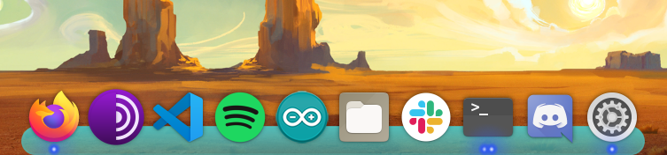
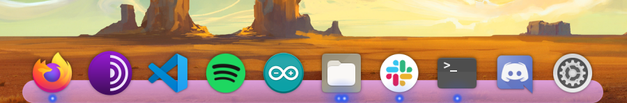
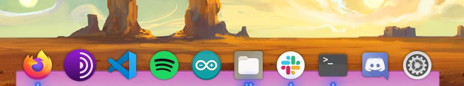

# Plank-Themes
Temas autorais para a dock Plank. 

-BlueKing:

-PurpleKing:

-PurpleRain:

# Utilização em distros baseadas no Debian/Arch
Colocar os diretórios dos temas desejados em ~/.local/share/plank/themes (caso não exista "themes" você pode criá-la).
